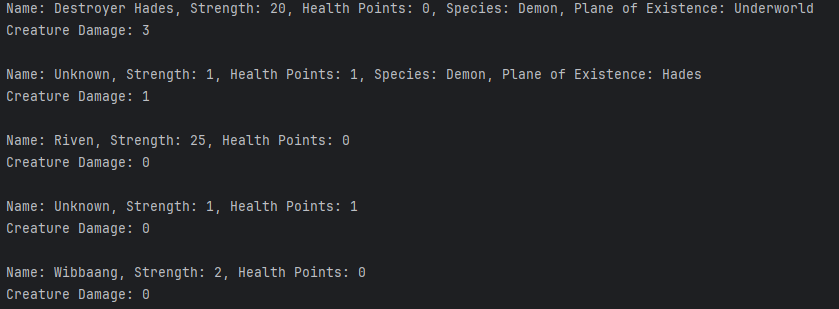
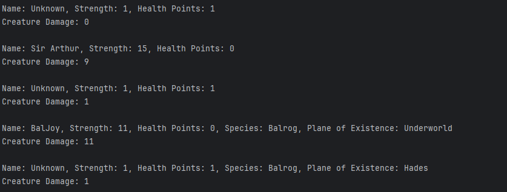
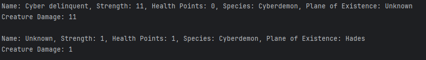
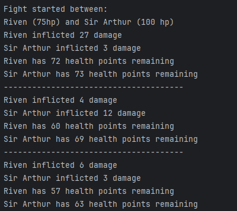
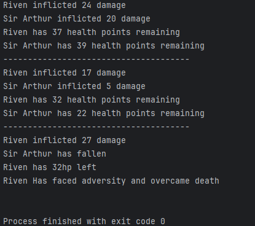

# Fantasy Combat Simulator
### Author: Rudy S

--- 

## Overview
The **Fantasy Combat Simulator** is a dynamic Java-based project that brings an engaging fantasy world to life. 
It features a diverse roster of creatures with unique traits and battle mechanics. 
Each creature is part of a well-structured hierarchy, allowing for easy expansion with new types, abilities, and interactions.
## Features

___

- **Creature Base Class:** A superclass for all creatures with common attributes like name, strength, and health points.
- **Specialized Subclasses:** Unique creature types such as `Elf`, `Goblin`, `Demon`, `Cyberdemon`, `Balrog`, and `Human`.
- **Combat Logic:** A `Combat` class simulates fights to the death between two creatures.
- **Randomized Damage Calculation:** Each creature has unique damage mechanics (e.g., critical hits for Cyberdemons).

---

## Classes Overview

### `Creature` (Base Class)
- **Attributes:**
    - `name`: The creature's name.
    - `strength`: The creature's attack power.
    - `healthPoints`: The creature's current health.
- **Methods:**
    - `getDamage()`: Calculates attack damage.
    - Getters and setters for all attributes.

### Subclasses
- **`Elf` and `Goblin`:** Halved damage compared to other creatures.
- **`Human`:** Standard damage inherited from `Creature`.
- **`Demon`:** Introduces the concept of a "plane of existence."
- **`Cyberdemon`:** 1% chance for a critical hit causing 1000 damage.
- **`Balrog`:** High-damage subclass of `Demon`.

### `Combat` Class
- Simulates a turn-based fight between two creatures.
- Prints attack logs, remaining health, and the outcome.
- 
---

## How It Works

1. **Initialization:**
    - A list of creatures is created with their attributes.
2. **Combat Simulation:**
    - Two creatures are chosen to fight until one is defeated.
3. **Output:**
    - Detailed attack logs, including damage dealt and remaining health.

## Sample Images
Modify the Fantasy class to customize the creatures or battles.  
Compile and run the program to view the combat simulation in the console.

  
  
  

## Future Improvements
Add more creature subclasses with unique abilities.
Enhance the combat system with:
Multi-creature battles.
Special abilities for certain species.
Create a graphical user interface (GUI) for better visualization.
Add logging functionality to save battle outcomes.
